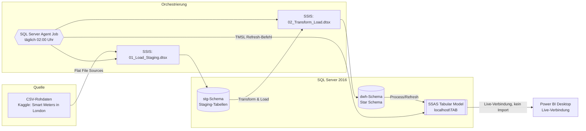
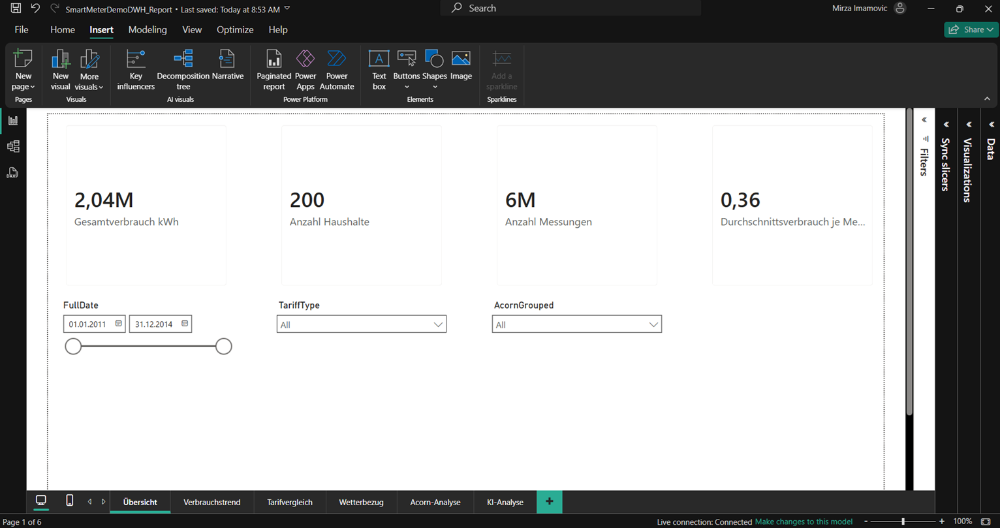
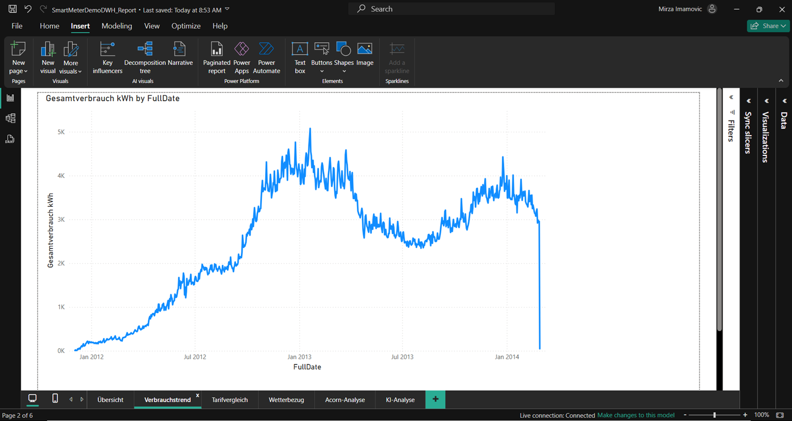
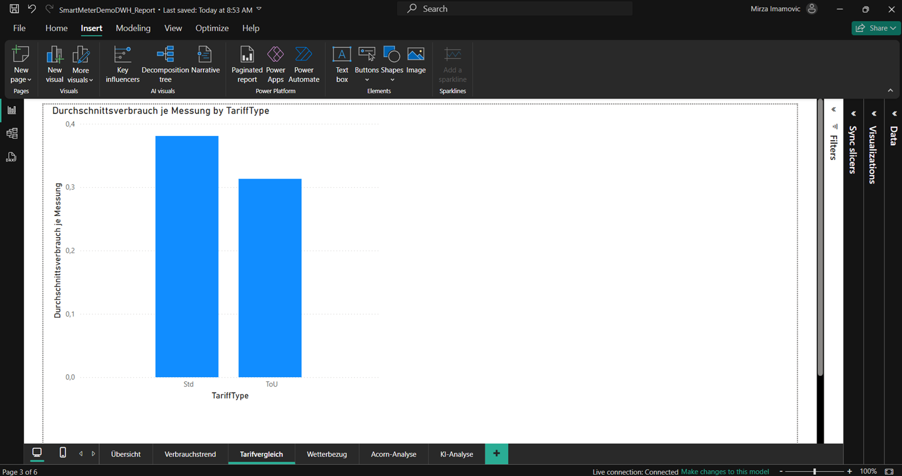
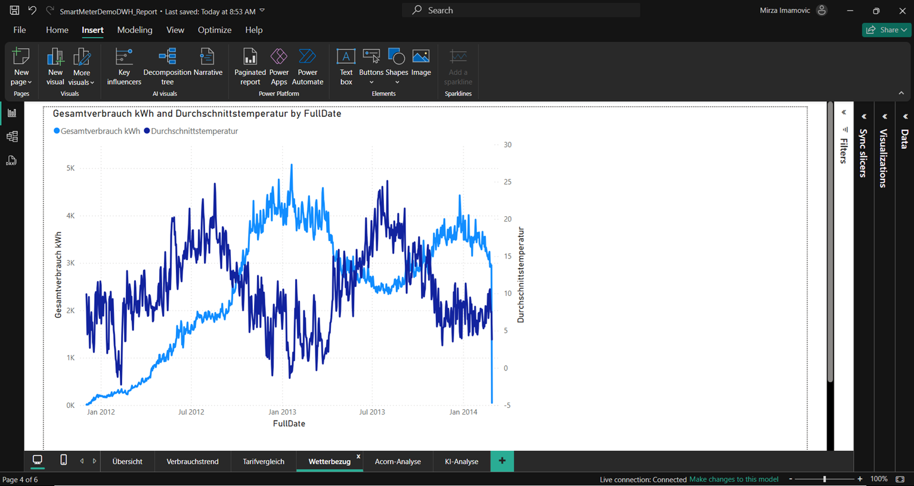
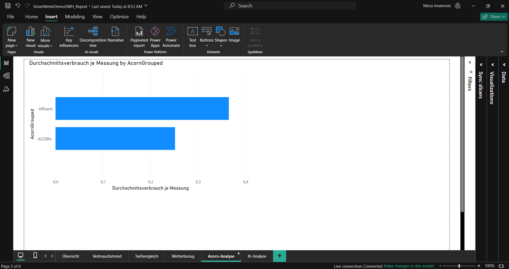
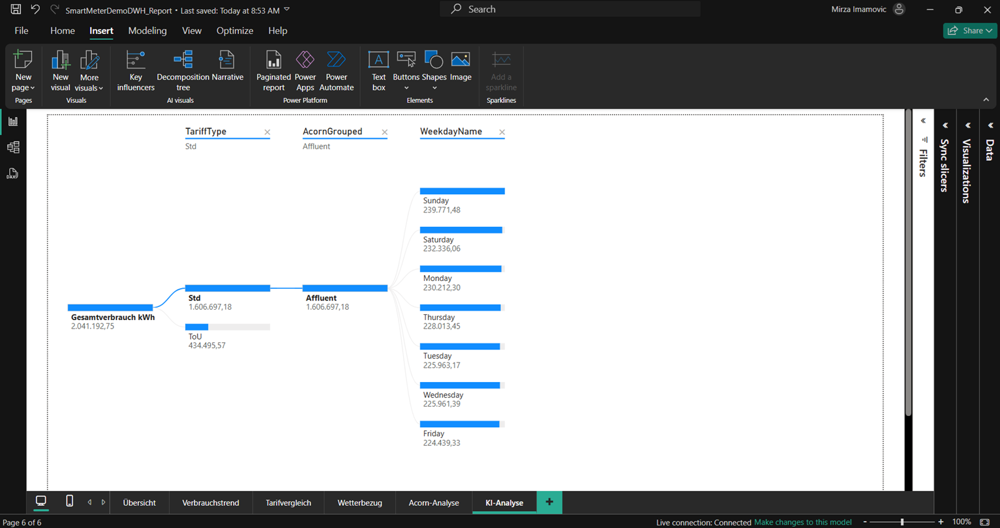

# Smart Meter Data Warehouse – Klassischer BI-Stack (SSIS / SSAS / Power BI)

Demoprojekt zur Veranschaulichung eines klassischen, on-premises Business-Intelligence-Stacks auf Basis von Microsoft SQL Server. Das Projekt bildet einen vollständigen, automatisierten End-to-End-Datenfluss ab: von rohen CSV-Dateien bis zum interaktiven Power-BI-Report, inklusive nächtlicher Orchestrierung.

## Inhaltsverzeichnis

- [Überblick](#überblick)
- [Architektur](#architektur)
- [Datenquelle](#datenquelle)
- [Dimensionales Modell](#dimensionales-modell)
- [ETL-Schicht (SSIS)](#etl-schicht-ssis)
- [Semantisches Modell (SSAS Tabular)](#semantisches-modell-ssas-tabular)
- [Power BI Report](#power-bi-report)
- [Automatisierung](#automatisierung)
- [Projektstruktur](#projektstruktur)
- [Setup / Lokale Ausführung](#setup--lokale-ausführung)
- [Technischer Hintergrund & Design-Entscheidungen](#technischer-hintergrund--design-entscheidungen)

## Überblick

Das Projekt lädt, transformiert und modelliert Smart-Meter-Verbrauchsdaten von 200 Londoner Haushalten (ca. 5,6 Mio. Halbstunden-Messwerte, Dez. 2011 – Feb. 2014) inklusive Wetter-, Tarif- und demografischer Zusatzdaten in ein klassisches Kimball-Star-Schema. Der komplette Ladeprozess läuft automatisiert über einen SQL-Server-Agent-Job; das Analysis-Services-Tabular-Modell wird live von Power BI konsumiert.

**Tech-Stack:** SQL Server 2016 (Database Engine, SSIS, SSAS Tabular, SQL Server Agent), Power BI Desktop (Live-Verbindung).

## Architektur



Der SQL-Server-Agent-Job orchestriert alle drei Schritte sequenziell (Staging laden → Star Schema transformieren/laden → SSAS-Modell verarbeiten) und läuft täglich automatisch, ohne manuellen Eingriff.

## Datenquelle

- **Dataset:** [Smart meters in London](https://www.kaggle.com/datasets/jeanmidev/smart-meters-in-london) (Kaggle)
- **Umfang:** 200 Haushalte (Blöcke 0–3 des Originaldatensatzes), ca. 5.606.314 Halbstunden-Messwerte
- **Zeitraum:** Dezember 2011 – Februar 2014
- **Zusatzdaten:** stündliche Wetterdaten (Temperatur, gefühlte Temperatur, Luftfeuchtigkeit, Windgeschwindigkeit), Tarifart (Standard vs. Time-of-Use), Acorn-Sozioökonomiegruppen, UK-Feiertage

Rohdaten sind nicht Teil dieses Repositories (Lizenz/Größe), sondern werden lokal unter `data/` erwartet.

## Dimensionales Modell

Klassisches Kimball-Star-Schema, `Fact_Consumption` im Zentrum, fünf Dimensionen:

| Tabelle | Grain / Inhalt | Zeilen |
|---|---|---|
| `Fact_Consumption` | ein Messwert je Haushalt und Halbstunden-Intervall | 5.606.314 |
| `Dim_Household` | Haushalt, Tarifart, Acorn-Gruppe | 5.566 |
| `Dim_Date` | ein Kalendertag | 1.461 |
| `Dim_Time` | ein Halbstunden-Slot (0–47) | 48 |
| `Dim_Weather` | eine Stunden-Wettermessung | 21.165 |
| `Dim_Tariff` | Tarifart (Std / ToU) | 2 |

`Dim_Date` und `Dim_Time` sind bewusst getrennt (statt einer kombinierten DateTime-Dimension) – Standard-Kimball-Pattern, das beide Dimensionen klein, statisch und über beliebig viele zukünftige Fact-Tabellen wiederverwendbar (conformed) hält.

## ETL-Schicht (SSIS)

**Paket 1 – `01_Load_Staging.dtsx`**
Truncate-and-Load-Muster: ein Execute-SQL-Task leert alle 5 Staging-Tabellen, danach laden fünf Data-Flow-Tasks die Rohdaten (vier einzelne CSVs + ein Foreach-Loop-Container für die vier Verbrauchsblöcke `block_0.csv`–`block_3.csv`, dynamische Dateibindung über Property Expressions).

**Paket 2 – `02_Transform_Load.dtsx`**
Lädt aus der Staging- in die dwh-Schicht: Delete-and-Load für `Dim_Household`, `Dim_Weather` und `Fact_Consumption` (Delete statt Truncate, da FK-Constraints aus der Fact-Tabelle Truncate auf referenzierte Dimensionen verhindern). Idempotent – beliebig oft wiederholbar ohne Duplikate.

## Semantisches Modell (SSAS Tabular)

- Kompatibilitätsgrad 1200 (SQL Server 2016)
- Deployed auf lokale Tabular-Instanz `localhost\TAB`
- Beziehungen 1:n von jeder Dimension zur Fact-Tabelle, automatisch erkannt
- Kern-Measures: `Gesamtverbrauch kWh`, `Anzahl Haushalte`, `Anzahl Messungen`, `Durchschnittsverbrauch je Messung`, `Durchschnittstemperatur`
- `Dim_Date` als offizielle Datumstabelle markiert (Voraussetzung für Zeitintelligenz und korrekte Achsensortierung in Power BI)

## Power BI Report

Live-Verbindung (kein Import) zum SSAS-Tabular-Modell, 6 Seiten:

1. **Übersicht** – KPI-Kacheln (Gesamtverbrauch, Haushalte, Messungen, Ø Verbrauch) + report-weite Slicer (Datumsbereich, Tarif, Acorn-Gruppe)

   

2. **Verbrauchstrend** – Zeitreihe des Gesamtverbrauchs über den kompletten Datenzeitraum

   

3. **Tarifvergleich** – Ø Verbrauch je Messung nach Tarifart (Std vs. ToU)

   

4. **Wetterbezug** – Verbrauch vs. Durchschnittstemperatur (Sekundärachse) – klassischer Heizeffekt sichtbar

   

5. **Acorn-Analyse** – Verbrauch nach sozioökonomischer Haushaltsgruppe

   

6. **KI-Analyse** – Decomposition Tree (interaktive Aufschlüsselung nach Tarif, Acorn-Gruppe, Wochentag)

   

> Hinweis: Power-BI-KI-Visuals wie *Key Influencers* und *Smart Narrative* werden bei Live-Verbindungen zu Analysis Services offiziell nicht unterstützt – bewusste Architekturentscheidung zugunsten einer einzigen, konsistenten Live-Datenquelle statt eines importierten Duplikats.

## Automatisierung

SQL-Server-Agent-Job `SmartMeterDWH_Nightly_ETL`, täglich 02:00 Uhr:

| Schritt | Typ | Aktion |
|---|---|---|
| 1 | SSIS-Paket | `01_Load_Staging.dtsx` ausführen |
| 2 | SSIS-Paket | `02_Transform_Load.dtsx` ausführen |
| 3 | SSAS-Befehl (TMSL) | Full Refresh von `SmartMeterDemoDWH_SSAS` |

Bei Fehler bricht der Job ab und protokolliert im Windows-Anwendungsereignisprotokoll. Da der Agent-Dienst unter einem eigenen Systemkonto läuft, liegen alle Paket- und Datendateien in einem neutralen, freigegebenen Pfad (`C:\SSIS_Packages\...`), nicht im persönlichen Benutzerprofil/OneDrive.

## Projektstruktur

```
smartmeter-classic-dwh-demo/
├── SmartMeterDemoDWH_ETL/         # SSIS-Projekt (Visual Studio)
│   ├── 01_Load_Staging.dtsx
│   └── 02_Transform_Load.dtsx
├── SmartMeterDemoDWH_SSAS/        # SSAS-Tabular-Projekt (Visual Studio)
│   └── Model.bim
├── SmartMeterDemoDWH_Report.pbix  # Power BI Report
├── sql/                           # DDL-Skripte (stg- & dwh-Schema, Dim-Ladeskripte)
├── data/                          # Rohdaten (nicht im Repo, lokal bereitstellen)
└── screenshots/                   # Report-Screenshots für dieses README
```

## Setup / Lokale Ausführung

1. SQL Server 2016+ (Database Engine, SSAS Tabular, SQL Server Agent) sowie Visual Studio mit den Erweiterungen "SQL Server Integration Services Projects" und "Analysis Services Projects" installieren.
2. Rohdaten von Kaggle herunterladen, nach `data/` entpacken.
3. Datenbank `SmartMeterDemoDWH` inkl. `stg`- und `dwh`-Schema anlegen (Skripte unter `sql/`).
4. SSIS-Projekt in Visual Studio öffnen, Verbindungs-Manager-Pfade auf lokale `data/`-Ablage prüfen, `01_Load_Staging.dtsx` und `02_Transform_Load.dtsx` einmalig manuell ausführen.
5. SSAS-Tabular-Projekt öffnen, auf lokale Tabular-Instanz bereitstellen.
6. `.pbix` öffnen, Live-Verbindung auf die eigene SSAS-Instanz umstellen.
7. Optional: SQL-Server-Agent-Job für automatisierten nächtlichen Lauf einrichten (Skript/Anleitung siehe `sql/02_agent_job.sql`).

## Technischer Hintergrund & Design-Entscheidungen

- **Delete statt Truncate** bei den Dimensionstabellen: SQL Server verbietet `TRUNCATE` auf Tabellen, die von einem Foreign Key referenziert werden – unabhängig vom aktuellen Datenstand der referenzierenden Tabelle.
- **Getrennte Date-/Time-Dimension:** vermeidet eine mit dem Fact-Table mitwachsende, nicht wiederverwendbare kombinierte Dimension; ermöglicht conformed Dimensions über mehrere zukünftige Fact-Tabellen hinweg.
- **Live-Verbindung statt Import in Power BI:** eine einzige Quelle der Wahrheit, keine Datenduplikation – Trade-off: bestimmte Copilot-/KI-Visuals sind dadurch nicht verfügbar (siehe oben).
- **Automatisierung über SQL Server Agent statt manueller Ausführung:** produktionsnahes Muster für eine "richtige" orchestrierte Pipeline statt einmaliger Demo-Läufe.
